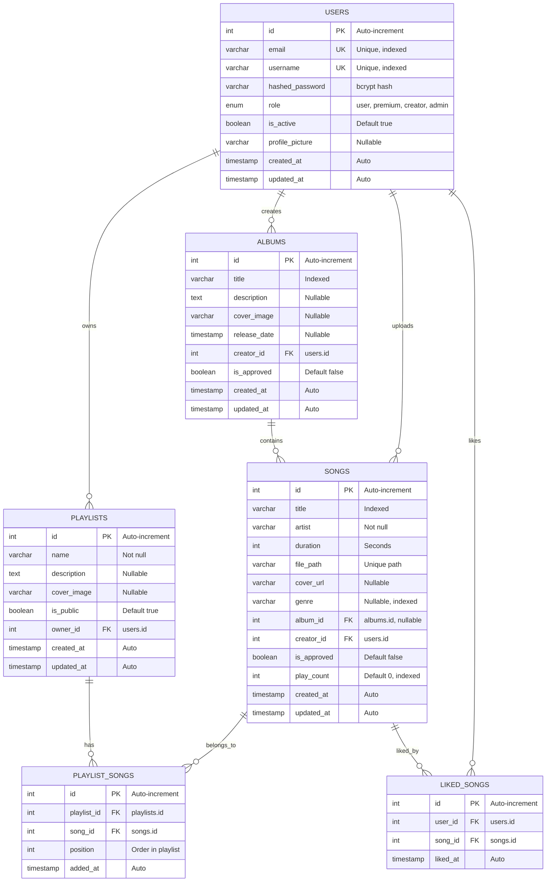

# 🗄️ P-Music TD - Database Documentation

**Database Engine**: PostgreSQL 16+  
**ORM**: SQLAlchemy 2.0.25  
**Migration Tool**: Alembic 1.13.1  
**Database Name**: `music_app`  
**Última actualización**: Noviembre 2025

---

## 📑 Tabla de Contenidos

- [Visión General](#-visión-general)
- [Diagrama Entidad-Relación](#-diagrama-entidad-relación)
- [Normalización](#-normalización)
- [Tablas del Sistema](#-tablas-del-sistema)
- [Relaciones](#-relaciones)
- [Índices y Optimización](#-índices-y-optimización)
- [Constraints e Integridad](#-constraints-e-integridad)
- [Migraciones](#-migraciones)
- [Queries Comunes](#-queries-comunes)

---

## 🎯 Visión General

La base de datos de **P-Music TD** está diseñada siguiendo los principios de normalización (3NF) para garantizar:

- ✅ **Integridad referencial**: Foreign keys con constraints
- ✅ **Eliminación de redundancia**: Datos no duplicados
- ✅ **Escalabilidad**: Preparada para millones de registros
- ✅ **Performance**: Índices estratégicos en columnas críticas
- ✅ **Auditoría**: Timestamps automáticos (created_at, updated_at)
- ✅ **Seguridad**: Passwords hasheados, roles con enums

### Características Técnicas

| Característica | Implementación |
|----------------|----------------|
| **Motor** | PostgreSQL 16 (Relational ACID-compliant) |
| **ORM** | SQLAlchemy 2.0 (Async support) |
| **Migraciones** | Alembic (Version control) |
| **Encoding** | UTF-8 |
| **Timezone** | UTC (timestamps con timezone) |
| **Collation** | es_ES.UTF-8 (soporte español) |

---

## 🔷 Diagrama Entidad-Relación

### Diagrama Completo en Mermaid



### Diagrama Simplificado de Relaciones

```
         ┌──────────────┐
         │    USERS     │
         │   (Usuarios) │
         └──────┬───────┘
                │
        ┌───────┼────────┬──────────┐
        │       │        │          │
        ▼       ▼        ▼          ▼
   ┌─────────┐ ┌─────┐ ┌────────┐ ┌─────────────┐
   │ ALBUMS  │ │SONGS│ │PLAYLIST│ │ LIKED_SONGS │
   └────┬────┘ └──┬──┘ └───┬────┘ └──────┬──────┘
        │         │        │             │
        └────┐    └────┐   │             │
             │         │   │             │
             ▼         ▼   ▼             ▼
           ┌──────────────────┐    ┌─────────┐
           │      SONGS        │◄───┤  SONGS  │
           └──────────────────┘    └─────────┘
                     │
                     ▼
           ┌──────────────────┐
           │  PLAYLIST_SONGS  │
           └──────────────────┘
```

---

## 📐 Normalización

La base de datos cumple con la **Tercera Forma Normal (3NF)**, garantizando:

### Primera Forma Normal (1NF)

✅ **Atomicidad**: Cada columna contiene valores atómicos (indivisibles)
- ❌ NO: `genres = "rock, pop, jazz"` (múltiples valores)
- ✅ SÍ: `genre = "rock"` (valor único)

✅ **Unicidad de columnas**: Cada columna tiene nombre único
✅ **Sin grupos repetitivos**: No hay arrays ni listas en columnas

### Segunda Forma Normal (2NF)

✅ **Dependencia completa de clave primaria**: Todos los atributos no-clave dependen completamente de la PK

**Ejemplo**:
- Tabla `SONGS`: `title`, `artist`, `duration` dependen de `song.id`
- Tabla `PLAYLIST_SONGS`: `position` depende de `(playlist_id, song_id)`

### Tercera Forma Normal (3NF)

✅ **Sin dependencias transitivas**: No hay dependencias entre atributos no-clave

**Ejemplo de normalización aplicada**:

❌ **ANTES (No normalizado)**:
```sql
SONGS
├── id
├── title
├── artist
├── album_title        -- Dependencia transitiva!
├── album_cover        -- Dependencia transitiva!
└── creator_email      -- Dependencia transitiva!
```

✅ **DESPUÉS (Normalizado 3NF)**:
```sql
SONGS
├── id
├── title
├── artist
├── album_id (FK)      -- Referencia a ALBUMS
└── creator_id (FK)    -- Referencia a USERS

ALBUMS
├── id
├── title
├── cover_image
└── creator_id (FK)

USERS
├── id
├── email
└── username
```

### Denormalización Estratégica

Algunos campos están **intencionalmente denormalizados** por performance:

| Campo | Tabla | Razón |
|-------|-------|-------|
| `artist` | songs | Búsqueda rápida sin JOIN con albums |
| `cover_url` | songs | Portada individual vs. portada de álbum |
| `play_count` | songs | Lectura frecuente, escritura async |

---

## 📊 Tablas del Sistema

### 1. `users` - Tabla de Usuarios

**Descripción**: Almacena información de usuarios registrados con sistema de roles.

#### Estructura

```sql
CREATE TABLE users (
    id SERIAL PRIMARY KEY,
    email VARCHAR(255) UNIQUE NOT NULL,
    username VARCHAR(100) UNIQUE NOT NULL,
    hashed_password VARCHAR(255) NOT NULL,
    role VARCHAR(20) DEFAULT 'user' NOT NULL,
    is_active BOOLEAN DEFAULT TRUE,
    profile_picture VARCHAR(500),
    created_at TIMESTAMP WITH TIME ZONE DEFAULT CURRENT_TIMESTAMP,
    updated_at TIMESTAMP WITH TIME ZONE DEFAULT CURRENT_TIMESTAMP
);
```

#### Columnas

| Columna | Tipo | Constraints | Descripción |
|---------|------|-------------|-------------|
| **id** | `SERIAL` | `PRIMARY KEY` | Identificador único auto-incremental |
| **email** | `VARCHAR(255)` | `UNIQUE`, `NOT NULL`, `INDEXED` | Correo electrónico para login |
| **username** | `VARCHAR(100)` | `UNIQUE`, `NOT NULL`, `INDEXED` | Nombre de usuario para login |
| **hashed_password** | `VARCHAR(255)` | `NOT NULL` | Contraseña hasheada con bcrypt |
| **role** | `ENUM` | `NOT NULL`, `DEFAULT 'user'` | Rol del usuario: user/premium/creator/admin |
| **is_active** | `BOOLEAN` | `DEFAULT TRUE` | Estado de la cuenta (activa/suspendida) |
| **profile_picture** | `VARCHAR(500)` | `NULL` | URL de imagen de perfil |
| **created_at** | `TIMESTAMP TZ` | `DEFAULT NOW()` | Fecha de registro |
| **updated_at** | `TIMESTAMP TZ` | `ON UPDATE NOW()` | Última actualización de perfil |

#### Enum: UserRole

```sql
CREATE TYPE user_role AS ENUM (
    'user',      -- Usuario estándar
    'premium',   -- Usuario premium (sin ads)
    'creator',   -- Creador de contenido
    'admin'      -- Administrador del sistema
);
```

#### Índices

```sql
CREATE INDEX idx_users_email ON users(email);
CREATE INDEX idx_users_username ON users(username);
CREATE INDEX idx_users_role ON users(role);
```

#### Ejemplo de Datos

```sql
INSERT INTO users (email, username, hashed_password, role) VALUES
('john@example.com', 'john_doe', '$2b$12$...', 'user'),
('artist@music.com', 'cool_artist', '$2b$12$...', 'creator'),
('admin@pmusic.com', 'admin', '$2b$12$...', 'admin');
```

---

### 2. `albums` - Tabla de Álbumes

**Descripción**: Agrupa canciones en álbumes creados por usuarios con rol creator.

#### Estructura

```sql
CREATE TABLE albums (
    id SERIAL PRIMARY KEY,
    title VARCHAR(255) NOT NULL,
    description TEXT,
    cover_image VARCHAR(500),
    release_date TIMESTAMP WITH TIME ZONE,
    creator_id INTEGER NOT NULL REFERENCES users(id) ON DELETE CASCADE,
    is_approved BOOLEAN DEFAULT FALSE,
    created_at TIMESTAMP WITH TIME ZONE DEFAULT CURRENT_TIMESTAMP,
    updated_at TIMESTAMP WITH TIME ZONE DEFAULT CURRENT_TIMESTAMP
);
```

#### Columnas

| Columna | Tipo | Constraints | Descripción |
|---------|------|-------------|-------------|
| **id** | `SERIAL` | `PRIMARY KEY` | Identificador único |
| **title** | `VARCHAR(255)` | `NOT NULL`, `INDEXED` | Título del álbum |
| **description** | `TEXT` | `NULL` | Descripción o sinopsis del álbum |
| **cover_image** | `VARCHAR(500)` | `NULL` | URL de la portada del álbum |
| **release_date** | `TIMESTAMP TZ` | `NULL` | Fecha de lanzamiento original |
| **creator_id** | `INTEGER` | `FK users.id`, `NOT NULL` | Creador del álbum |
| **is_approved** | `BOOLEAN` | `DEFAULT FALSE` | Aprobación por admin |
| **created_at** | `TIMESTAMP TZ` | `DEFAULT NOW()` | Fecha de creación |
| **updated_at** | `TIMESTAMP TZ` | `ON UPDATE NOW()` | Última actualización |

#### Índices

```sql
CREATE INDEX idx_albums_title ON albums(title);
CREATE INDEX idx_albums_creator ON albums(creator_id);
CREATE INDEX idx_albums_approved ON albums(is_approved);
```

#### Relaciones

- **N:1 con users**: Un álbum pertenece a un creador
- **1:N con songs**: Un álbum contiene múltiples canciones

---

### 3. `songs` - Tabla de Canciones

**Descripción**: Almacena información de canciones individuales con metadata completa.

#### Estructura

```sql
CREATE TABLE songs (
    id SERIAL PRIMARY KEY,
    title VARCHAR(255) NOT NULL,
    artist VARCHAR(255) NOT NULL,
    duration INTEGER NOT NULL,
    file_path VARCHAR(500) UNIQUE NOT NULL,
    cover_url VARCHAR(500),
    genre VARCHAR(50),
    album_id INTEGER REFERENCES albums(id) ON DELETE SET NULL,
    creator_id INTEGER NOT NULL REFERENCES users(id) ON DELETE CASCADE,
    is_approved BOOLEAN DEFAULT FALSE,
    play_count INTEGER DEFAULT 0,
    created_at TIMESTAMP WITH TIME ZONE DEFAULT CURRENT_TIMESTAMP,
    updated_at TIMESTAMP WITH TIME ZONE DEFAULT CURRENT_TIMESTAMP
);
```

#### Columnas

| Columna | Tipo | Constraints | Descripción |
|---------|------|-------------|-------------|
| **id** | `SERIAL` | `PRIMARY KEY` | Identificador único |
| **title** | `VARCHAR(255)` | `NOT NULL`, `INDEXED` | Título de la canción |
| **artist** | `VARCHAR(255)` | `NOT NULL`, `INDEXED` | Nombre del artista (denormalizado) |
| **duration** | `INTEGER` | `NOT NULL` | Duración en segundos |
| **file_path** | `VARCHAR(500)` | `UNIQUE`, `NOT NULL` | Ruta al archivo de audio |
| **cover_url** | `VARCHAR(500)` | `NULL` | URL de portada individual |
| **genre** | `VARCHAR(50)` | `NULL`, `INDEXED` | Género musical |
| **album_id** | `INTEGER` | `FK albums.id`, `NULL` | Álbum al que pertenece (opcional) |
| **creator_id** | `INTEGER` | `FK users.id`, `NOT NULL` | Usuario que subió la canción |
| **is_approved** | `BOOLEAN` | `DEFAULT FALSE`, `INDEXED` | Aprobación por admin |
| **play_count** | `INTEGER` | `DEFAULT 0`, `INDEXED` | Contador de reproducciones |
| **created_at** | `TIMESTAMP TZ` | `DEFAULT NOW()` | Fecha de subida |
| **updated_at** | `TIMESTAMP TZ` | `ON UPDATE NOW()` | Última actualización |

#### Índices

```sql
CREATE INDEX idx_songs_title ON songs(title);
CREATE INDEX idx_songs_artist ON songs(artist);
CREATE INDEX idx_songs_genre ON songs(genre);
CREATE INDEX idx_songs_album ON songs(album_id);
CREATE INDEX idx_songs_creator ON songs(creator_id);
CREATE INDEX idx_songs_approved ON songs(is_approved);
CREATE INDEX idx_songs_play_count ON songs(play_count DESC);

-- Índices para búsqueda full-text (PostgreSQL)
CREATE INDEX idx_songs_title_trgm ON songs USING gin(title gin_trgm_ops);
CREATE INDEX idx_songs_artist_trgm ON songs USING gin(artist gin_trgm_ops);
```

#### Relaciones

- **N:1 con albums**: Una canción puede pertenecer a un álbum (opcional)
- **N:1 con users**: Una canción tiene un creador
- **1:N con playlist_songs**: Una canción puede estar en múltiples playlists
- **1:N con liked_songs**: Una canción puede ser marcada como favorita por múltiples usuarios

---

### 4. `playlists` - Tabla de Playlists

**Descripción**: Colecciones personalizadas de canciones creadas por usuarios.

#### Estructura

```sql
CREATE TABLE playlists (
    id SERIAL PRIMARY KEY,
    name VARCHAR(255) NOT NULL,
    description TEXT,
    cover_image VARCHAR(500),
    is_public BOOLEAN DEFAULT TRUE,
    owner_id INTEGER NOT NULL REFERENCES users(id) ON DELETE CASCADE,
    created_at TIMESTAMP WITH TIME ZONE DEFAULT CURRENT_TIMESTAMP,
    updated_at TIMESTAMP WITH TIME ZONE DEFAULT CURRENT_TIMESTAMP
);
```

#### Columnas

| Columna | Tipo | Constraints | Descripción |
|---------|------|-------------|-------------|
| **id** | `SERIAL` | `PRIMARY KEY` | Identificador único |
| **name** | `VARCHAR(255)` | `NOT NULL` | Nombre de la playlist |
| **description** | `TEXT` | `NULL` | Descripción de la playlist |
| **cover_image** | `VARCHAR(500)` | `NULL` | URL de portada personalizada |
| **is_public** | `BOOLEAN` | `DEFAULT TRUE` | Visibilidad pública/privada |
| **owner_id** | `INTEGER` | `FK users.id`, `NOT NULL` | Propietario de la playlist |
| **created_at** | `TIMESTAMP TZ` | `DEFAULT NOW()` | Fecha de creación |
| **updated_at** | `TIMESTAMP TZ` | `ON UPDATE NOW()` | Última modificación |

#### Índices

```sql
CREATE INDEX idx_playlists_owner ON playlists(owner_id);
CREATE INDEX idx_playlists_public ON playlists(is_public);
CREATE INDEX idx_playlists_name ON playlists(name);
```

#### Relaciones

- **N:1 con users**: Una playlist pertenece a un usuario
- **N:N con songs**: Una playlist contiene múltiples canciones (mediante playlist_songs)

---

### 5. `playlist_songs` - Tabla de Asociación (Many-to-Many)

**Descripción**: Tabla intermedia que relaciona playlists con canciones, incluyendo orden.

#### Estructura

```sql
CREATE TABLE playlist_songs (
    id SERIAL PRIMARY KEY,
    playlist_id INTEGER NOT NULL REFERENCES playlists(id) ON DELETE CASCADE,
    song_id INTEGER NOT NULL REFERENCES songs(id) ON DELETE CASCADE,
    position INTEGER NOT NULL,
    added_at TIMESTAMP WITH TIME ZONE DEFAULT CURRENT_TIMESTAMP,
    
    UNIQUE(playlist_id, song_id),  -- Evita duplicados
    UNIQUE(playlist_id, position)  -- Asegura orden único
);
```

#### Columnas

| Columna | Tipo | Constraints | Descripción |
|---------|------|-------------|-------------|
| **id** | `SERIAL` | `PRIMARY KEY` | Identificador único |
| **playlist_id** | `INTEGER` | `FK playlists.id`, `NOT NULL` | Referencia a playlist |
| **song_id** | `INTEGER` | `FK songs.id`, `NOT NULL` | Referencia a canción |
| **position** | `INTEGER` | `NOT NULL` | Posición en la playlist (orden) |
| **added_at** | `TIMESTAMP TZ` | `DEFAULT NOW()` | Fecha de agregación |

#### Constraints Únicos

```sql
-- Previene agregar la misma canción dos veces
ALTER TABLE playlist_songs 
ADD CONSTRAINT uk_playlist_song UNIQUE (playlist_id, song_id);

-- Asegura que cada posición sea única en la playlist
ALTER TABLE playlist_songs 
ADD CONSTRAINT uk_playlist_position UNIQUE (playlist_id, position);
```

#### Índices

```sql
CREATE INDEX idx_playlist_songs_playlist ON playlist_songs(playlist_id);
CREATE INDEX idx_playlist_songs_song ON playlist_songs(song_id);
CREATE INDEX idx_playlist_songs_position ON playlist_songs(playlist_id, position);
```

---

### 6. `liked_songs` - Tabla de Canciones Favoritas

**Descripción**: Tabla intermedia que relaciona usuarios con sus canciones favoritas.

#### Estructura

```sql
CREATE TABLE liked_songs (
    id SERIAL PRIMARY KEY,
    user_id INTEGER NOT NULL REFERENCES users(id) ON DELETE CASCADE,
    song_id INTEGER NOT NULL REFERENCES songs(id) ON DELETE CASCADE,
    liked_at TIMESTAMP WITH TIME ZONE DEFAULT CURRENT_TIMESTAMP,
    
    UNIQUE(user_id, song_id)  -- Un usuario no puede dar like dos veces
);
```

#### Columnas

| Columna | Tipo | Constraints | Descripción |
|---------|------|-------------|-------------|
| **id** | `SERIAL` | `PRIMARY KEY` | Identificador único |
| **user_id** | `INTEGER` | `FK users.id`, `NOT NULL` | Usuario que marcó favorito |
| **song_id** | `INTEGER` | `FK songs.id`, `NOT NULL` | Canción marcada como favorita |
| **liked_at** | `TIMESTAMP TZ` | `DEFAULT NOW()` | Fecha del "me gusta" |

#### Constraints Únicos

```sql
ALTER TABLE liked_songs 
ADD CONSTRAINT uk_user_liked_song UNIQUE (user_id, song_id);
```

#### Índices

```sql
CREATE INDEX idx_liked_songs_user ON liked_songs(user_id);
CREATE INDEX idx_liked_songs_song ON liked_songs(song_id);
CREATE INDEX idx_liked_songs_date ON liked_songs(liked_at DESC);
```

---

## 🔗 Relaciones

### Matriz de Relaciones

| Tabla Origen | Relación | Tabla Destino | Cardinalidad | Cascade |
|--------------|----------|---------------|--------------|---------|
| **users** | owns | playlists | 1:N | DELETE CASCADE |
| **users** | creates | albums | 1:N | DELETE CASCADE |
| **users** | uploads | songs | 1:N | DELETE CASCADE |
| **users** | likes | songs (via liked_songs) | N:N | DELETE CASCADE |
| **albums** | contains | songs | 1:N | SET NULL |
| **playlists** | has | songs (via playlist_songs) | N:N | DELETE CASCADE |

### Detalles de Foreign Keys

#### 1. **users → playlists**

```sql
ALTER TABLE playlists
ADD CONSTRAINT fk_playlists_owner
FOREIGN KEY (owner_id) REFERENCES users(id)
ON DELETE CASCADE;
```

**Comportamiento**: Si se elimina un usuario, todas sus playlists se eliminan automáticamente.

#### 2. **users → albums**

```sql
ALTER TABLE albums
ADD CONSTRAINT fk_albums_creator
FOREIGN KEY (creator_id) REFERENCES users(id)
ON DELETE CASCADE;
```

**Comportamiento**: Si se elimina un creator, todos sus álbumes se eliminan.

#### 3. **albums → songs**

```sql
ALTER TABLE songs
ADD CONSTRAINT fk_songs_album
FOREIGN KEY (album_id) REFERENCES albums(id)
ON DELETE SET NULL;
```

**Comportamiento**: Si se elimina un álbum, las canciones mantienen su existencia pero `album_id` se pone en NULL.

#### 4. **users → songs**

```sql
ALTER TABLE songs
ADD CONSTRAINT fk_songs_creator
FOREIGN KEY (creator_id) REFERENCES users(id)
ON DELETE CASCADE;
```

**Comportamiento**: Si se elimina un creator, todas sus canciones se eliminan.

#### 5. **playlists ↔ songs (Many-to-Many)**

```sql
ALTER TABLE playlist_songs
ADD CONSTRAINT fk_playlist_songs_playlist
FOREIGN KEY (playlist_id) REFERENCES playlists(id)
ON DELETE CASCADE;

ALTER TABLE playlist_songs
ADD CONSTRAINT fk_playlist_songs_song
FOREIGN KEY (song_id) REFERENCES songs(id)
ON DELETE CASCADE;
```

**Comportamiento**:
- Si se elimina una playlist, se eliminan todas sus relaciones con canciones
- Si se elimina una canción, se elimina de todas las playlists

#### 6. **users ↔ songs (Liked Songs, Many-to-Many)**

```sql
ALTER TABLE liked_songs
ADD CONSTRAINT fk_liked_songs_user
FOREIGN KEY (user_id) REFERENCES users(id)
ON DELETE CASCADE;

ALTER TABLE liked_songs
ADD CONSTRAINT fk_liked_songs_song
FOREIGN KEY (song_id) REFERENCES songs(id)
ON DELETE CASCADE;
```

**Comportamiento**:
- Si se elimina un usuario, se eliminan todos sus "me gusta"
- Si se elimina una canción, se eliminan todos los "me gusta" asociados

---

## 🚀 Índices y Optimización

### Estrategia de Indexación

#### Índices Primarios (Automáticos)

```sql
-- Creados automáticamente por PRIMARY KEY
CREATE UNIQUE INDEX users_pkey ON users(id);
CREATE UNIQUE INDEX albums_pkey ON albums(id);
CREATE UNIQUE INDEX songs_pkey ON songs(id);
CREATE UNIQUE INDEX playlists_pkey ON playlists(id);
CREATE UNIQUE INDEX playlist_songs_pkey ON playlist_songs(id);
CREATE UNIQUE INDEX liked_songs_pkey ON liked_songs(id);
```

#### Índices de Unicidad

```sql
-- Evitan duplicados
CREATE UNIQUE INDEX uk_users_email ON users(email);
CREATE UNIQUE INDEX uk_users_username ON users(username);
CREATE UNIQUE INDEX uk_songs_file_path ON songs(file_path);
CREATE UNIQUE INDEX uk_playlist_song ON playlist_songs(playlist_id, song_id);
CREATE UNIQUE INDEX uk_user_liked_song ON liked_songs(user_id, song_id);
```

#### Índices de Búsqueda

```sql
-- Para queries WHERE frecuentes
CREATE INDEX idx_songs_title ON songs(title);
CREATE INDEX idx_songs_artist ON songs(artist);
CREATE INDEX idx_songs_genre ON songs(genre);
CREATE INDEX idx_songs_approved ON songs(is_approved);
CREATE INDEX idx_albums_title ON albums(title);
CREATE INDEX idx_playlists_name ON playlists(name);
```

#### Índices de Ordenamiento

```sql
-- Para queries ORDER BY frecuentes
CREATE INDEX idx_songs_play_count ON songs(play_count DESC);
CREATE INDEX idx_songs_created_at ON songs(created_at DESC);
CREATE INDEX idx_liked_songs_date ON liked_songs(liked_at DESC);
```

#### Índices de Foreign Keys

```sql
-- Para joins eficientes
CREATE INDEX idx_songs_album ON songs(album_id);
CREATE INDEX idx_songs_creator ON songs(creator_id);
CREATE INDEX idx_albums_creator ON albums(creator_id);
CREATE INDEX idx_playlists_owner ON playlists(owner_id);
CREATE INDEX idx_playlist_songs_playlist ON playlist_songs(playlist_id);
CREATE INDEX idx_playlist_songs_song ON playlist_songs(song_id);
```

#### Índices Full-Text Search (PostgreSQL)

```sql
-- Extensión para búsqueda fuzzy
CREATE EXTENSION IF NOT EXISTS pg_trgm;

-- Índices GIN para ILIKE rápido
CREATE INDEX idx_songs_title_trgm ON songs USING gin(title gin_trgm_ops);
CREATE INDEX idx_songs_artist_trgm ON songs USING gin(artist gin_trgm_ops);
```

**Beneficio**: Búsquedas tipo `WHERE title ILIKE '%query%'` son hasta 100x más rápidas.

#### Índices Compuestos

```sql
-- Para queries que filtran por múltiples columnas
CREATE INDEX idx_songs_approved_genre ON songs(is_approved, genre);
CREATE INDEX idx_songs_creator_approved ON songs(creator_id, is_approved);
CREATE INDEX idx_playlist_songs_position ON playlist_songs(playlist_id, position);
```

### Análisis de Performance

```sql
-- Ver uso de índices
SELECT 
    schemaname,
    tablename,
    indexname,
    idx_scan as index_scans,
    idx_tup_read as tuples_read,
    idx_tup_fetch as tuples_fetched
FROM pg_stat_user_indexes
ORDER BY idx_scan DESC;

-- Ver queries lentas
SELECT 
    query,
    calls,
    total_time,
    mean_time,
    max_time
FROM pg_stat_statements
ORDER BY mean_time DESC
LIMIT 10;
```

---

## 🔒 Constraints e Integridad

### Check Constraints

```sql
-- Validar duración de canción (entre 1 segundo y 1 hora)
ALTER TABLE songs
ADD CONSTRAINT chk_songs_duration
CHECK (duration > 0 AND duration <= 3600);

-- Validar posición en playlist (no negativa)
ALTER TABLE playlist_songs
ADD CONSTRAINT chk_position_positive
CHECK (position >= 0);

-- Validar play_count (no negativo)
ALTER TABLE songs
ADD CONSTRAINT chk_play_count_positive
CHECK (play_count >= 0);

-- Validar rol de usuario
ALTER TABLE users
ADD CONSTRAINT chk_users_role
CHECK (role IN ('user', 'premium', 'creator', 'admin'));
```

### Triggers

#### 1. Actualizar `updated_at` automáticamente

```sql
-- Función genérica
CREATE OR REPLACE FUNCTION update_updated_at_column()
RETURNS TRIGGER AS $$
BEGIN
    NEW.updated_at = CURRENT_TIMESTAMP;
    RETURN NEW;
END;
$$ LANGUAGE plpgsql;

-- Aplicar a todas las tablas con updated_at
CREATE TRIGGER update_users_updated_at
    BEFORE UPDATE ON users
    FOR EACH ROW
    EXECUTE FUNCTION update_updated_at_column();

CREATE TRIGGER update_albums_updated_at
    BEFORE UPDATE ON albums
    FOR EACH ROW
    EXECUTE FUNCTION update_updated_at_column();

CREATE TRIGGER update_songs_updated_at
    BEFORE UPDATE ON songs
    FOR EACH ROW
    EXECUTE FUNCTION update_updated_at_column();

CREATE TRIGGER update_playlists_updated_at
    BEFORE UPDATE ON playlists
    FOR EACH ROW
    EXECUTE FUNCTION update_updated_at_column();
```

#### 2. Reordenar posiciones en playlist automáticamente

```sql
-- Función para ajustar posiciones cuando se elimina una canción
CREATE OR REPLACE FUNCTION adjust_playlist_positions()
RETURNS TRIGGER AS $$
BEGIN
    UPDATE playlist_songs
    SET position = position - 1
    WHERE playlist_id = OLD.playlist_id
    AND position > OLD.position;
    
    RETURN OLD;
END;
$$ LANGUAGE plpgsql;

CREATE TRIGGER adjust_positions_after_delete
    AFTER DELETE ON playlist_songs
    FOR EACH ROW
    EXECUTE FUNCTION adjust_playlist_positions();
```

### Default Values

```sql
-- Valores por defecto bien definidos
ALTER TABLE users ALTER COLUMN role SET DEFAULT 'user';
ALTER TABLE users ALTER COLUMN is_active SET DEFAULT TRUE;
ALTER TABLE albums ALTER COLUMN is_approved SET DEFAULT FALSE;
ALTER TABLE songs ALTER COLUMN is_approved SET DEFAULT FALSE;
ALTER TABLE songs ALTER COLUMN play_count SET DEFAULT 0;
ALTER TABLE playlists ALTER COLUMN is_public SET DEFAULT TRUE;
```

---

## 🔄 Migraciones

### Gestión con Alembic

#### Estructura de Migraciones

```
alembic/
├── versions/
│   ├── 001_initial_schema.py          # Creación inicial de tablas
│   ├── 002_add_genre_to_songs.py      # Agregar columna género
│   ├── 003_add_play_count_index.py    # Optimización de índices
│   └── 004_add_profile_picture.py     # Nueva columna en users
├── env.py                              # Configuración de Alembic
└── script.py.mako                      # Template para nuevas migraciones
```

#### Comandos Comunes

```bash
# Crear nueva migración (auto-detecta cambios en models)
alembic revision --autogenerate -m "Descripción del cambio"

# Aplicar todas las migraciones pendientes
alembic upgrade head

# Revertir última migración
alembic downgrade -1

# Ver historial de migraciones
alembic history

# Ver estado actual
alembic current

# Ir a una migración específica
alembic upgrade <revision_id>
```

#### Ejemplo de Migración

```python
# alembic/versions/002_add_genre_to_songs.py
"""add genre to songs

Revision ID: 002
Revises: 001
Create Date: 2025-11-19 10:00:00.000000

"""
from alembic import op
import sqlalchemy as sa

# revision identifiers
revision = '002'
down_revision = '001'
branch_labels = None
depends_on = None

def upgrade():
    op.add_column('songs', sa.Column('genre', sa.String(50), nullable=True))
    op.create_index('idx_songs_genre', 'songs', ['genre'])

def downgrade():
    op.drop_index('idx_songs_genre', 'songs')
    op.drop_column('songs', 'genre')
```

---

## 📝 Queries Comunes

### 1. Buscar canciones por título o artista (Full-Text)

```sql
SELECT 
    s.id,
    s.title,
    s.artist,
    s.duration,
    s.cover_url,
    a.title AS album_title,
    s.play_count
FROM songs s
LEFT JOIN albums a ON s.album_id = a.id
WHERE 
    s.is_approved = TRUE
    AND (
        s.title ILIKE '%rock%'
        OR s.artist ILIKE '%rock%'
    )
ORDER BY s.play_count DESC
LIMIT 50;
```

### 2. Obtener playlist completa con canciones ordenadas

```sql
SELECT 
    p.id AS playlist_id,
    p.name AS playlist_name,
    ps.position,
    s.id AS song_id,
    s.title,
    s.artist,
    s.duration,
    s.cover_url
FROM playlists p
JOIN playlist_songs ps ON p.id = ps.playlist_id
JOIN songs s ON ps.song_id = s.id
WHERE p.id = 1
ORDER BY ps.position ASC;
```

### 3. Obtener canciones favoritas de un usuario

```sql
SELECT 
    s.id,
    s.title,
    s.artist,
    s.duration,
    s.cover_url,
    ls.liked_at
FROM liked_songs ls
JOIN songs s ON ls.song_id = s.id
WHERE ls.user_id = 1
ORDER BY ls.liked_at DESC;
```

### 4. Top 10 canciones más reproducidas

```sql
SELECT 
    s.id,
    s.title,
    s.artist,
    s.play_count,
    a.title AS album_title,
    s.cover_url
FROM songs s
LEFT JOIN albums a ON s.album_id = a.id
WHERE s.is_approved = TRUE
ORDER BY s.play_count DESC
LIMIT 10;
```

### 5. Álbumes de un creador con conteo de canciones

```sql
SELECT 
    a.id,
    a.title,
    a.cover_image,
    a.release_date,
    a.is_approved,
    u.username AS creator_name,
    COUNT(s.id) AS song_count
FROM albums a
JOIN users u ON a.creator_id = u.id
LEFT JOIN songs s ON a.id = s.album_id
WHERE a.creator_id = 5
GROUP BY a.id, u.username
ORDER BY a.created_at DESC;
```

### 6. Canciones sin álbum (singles)

```sql
SELECT 
    s.id,
    s.title,
    s.artist,
    s.duration,
    s.play_count
FROM songs s
WHERE 
    s.album_id IS NULL
    AND s.is_approved = TRUE
ORDER BY s.created_at DESC;
```

### 7. Usuarios con más playlists

```sql
SELECT 
    u.id,
    u.username,
    u.role,
    COUNT(p.id) AS playlist_count
FROM users u
LEFT JOIN playlists p ON u.id = p.owner_id
GROUP BY u.id
ORDER BY playlist_count DESC
LIMIT 10;
```

### 8. Estadísticas generales del sistema

```sql
SELECT 
    (SELECT COUNT(*) FROM users) AS total_users,
    (SELECT COUNT(*) FROM users WHERE role = 'creator') AS total_creators,
    (SELECT COUNT(*) FROM songs WHERE is_approved = TRUE) AS approved_songs,
    (SELECT COUNT(*) FROM albums WHERE is_approved = TRUE) AS approved_albums,
    (SELECT COUNT(*) FROM playlists) AS total_playlists,
    (SELECT SUM(play_count) FROM songs) AS total_plays;
```

---

## 📊 Tamaño y Estimaciones

### Estimación de Crecimiento

| Tabla | Registros (Año 1) | Tamaño Aprox. | Crecimiento Anual |
|-------|-------------------|---------------|-------------------|
| **users** | 10,000 | ~2 MB | +50% |
| **songs** | 50,000 | ~10 MB | +100% |
| **albums** | 5,000 | ~1 MB | +80% |
| **playlists** | 20,000 | ~3 MB | +70% |
| **playlist_songs** | 500,000 | ~15 MB | +120% |
| **liked_songs** | 200,000 | ~8 MB | +90% |
| **TOTAL** | - | **~39 MB** | +95% |

**Nota**: Estimaciones sin incluir archivos de audio/imágenes (almacenados en filesystem).

### Queries de Mantenimiento

```sql
-- Ver tamaño de tablas
SELECT 
    schemaname,
    tablename,
    pg_size_pretty(pg_total_relation_size(schemaname||'.'||tablename)) AS size
FROM pg_tables
WHERE schemaname = 'public'
ORDER BY pg_total_relation_size(schemaname||'.'||tablename) DESC;

-- Reindexar tablas
REINDEX TABLE songs;
REINDEX TABLE users;

-- Vacuum para liberar espacio
VACUUM ANALYZE songs;
VACUUM ANALYZE playlists;
```

---

## 🔐 Backup y Recuperación

### Backup Completo

```bash
# Backup de base de datos completa
pg_dump -U postgres -d music_app -F c -f backup_$(date +%Y%m%d).dump

# Backup solo del schema
pg_dump -U postgres -d music_app --schema-only -f schema.sql

# Backup solo de datos
pg_dump -U postgres -d music_app --data-only -f data.sql
```

### Restauración

```bash
# Restaurar desde dump
pg_restore -U postgres -d music_app -c backup_20251119.dump

# Restaurar desde SQL
psql -U postgres -d music_app -f backup.sql
```

---

## 📚 Referencias

- **PostgreSQL Documentation**: https://www.postgresql.org/docs/16/
- **SQLAlchemy ORM**: https://docs.sqlalchemy.org/en/20/
- **Alembic Migrations**: https://alembic.sqlalchemy.org/
- **Database Normalization**: https://en.wikipedia.org/wiki/Database_normalization
- **PostgreSQL Full-Text Search**: https://www.postgresql.org/docs/current/textsearch.html

---

**Documento creado**: Noviembre 2025  
**Versión**: 1.0.0  
**Autor**: Anderson Terán  
**Proyecto**: P-Music TD